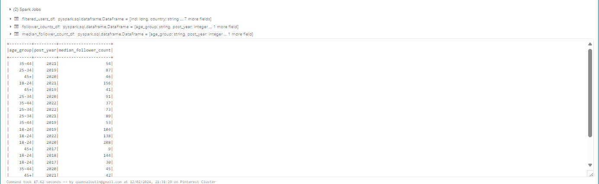

# Pinterest Data Pipelines

## Table of Contents
1. [Project description](#Project-description)
2. [Diagram of project architecture ](#Diagram-of-project-architecture)
3. [Installation instructions](#Installation-instructions)
4. [Project Code Breakdown](#Project-Code-Breakdown)
5. [Databricks Notebook](#Databricks-Notebooks)
6. [File structure of the project](#File-structure-of-the-project)
7. [License](#license)

### Project code breakdown

##  Project description
The Pinterest Data Pipelines Project aims to create a data pipeline similar to Pinterest. The data pipeline enhances the efficiency, scalability, and reliability of data processing infrastructure. As data continues to grow and serve millions of users worldwide, it becomes increasingly crucial to streamline the collection, processing, and analysis of vast amounts of user-generated data to drive product improvements, personalized recommendations, and strategic decision-making.

## Diagram of project architecture


## Tools
- Python
- AWS
- Apache Kafka
- Spark
- Databricks 

## Prerequisites
- AWS (Understanding of infrastructure and services)

## Installation instructions
 
1. Provision an EC2 and connect to it using SSH


### Run Kafka on E2C instance 
Update **Java** using this command :

```sh
sudo yum install java-1.8.0
```

Install Kafka on your client EC2 machine using this command
```sh
wget https://archive.apache.org/dist/kafka/2.8.1/kafka_2.12-2.8.1.tgz
```
```sh

tar -xzf kafka_2.12-2.8.1.tgz
```
Install the **IAM MSK authentication** package on your client EC2 machine using this command
```sh
wget https://github.com/aws/aws-msk-iam-auth/releases/download/v1.1.5/aws-msk-iam-auth-1.1.5-all.jar
```
- This package is used to authenticate the EC2 to MSK.

Navigate to Roles in IAM and change the Trust relationships Json to add the ARN in the summary box above
<details> 
<summary> More information  </summary>

 

</details>

Create configuration.properties in the Kafka bin
- This allows configuration of the Kafka client to use AWS IAM authentication to the cluster

Use this command to create the file
```sh
nano client.properties
```
<details> 
<summary> The file should look like this  </summary>


</details>

- Provision an MSK cluster on AWS with Kafka version 2.12-2.8.1
- Find the Bootstrap servers string and the Plaintext Apache Zookeeper connection string.
- Replace the awsRoleARN with your own ARN role 

Create a class path in the Kafka bin :
```sh
export CLASSPATH=/home/ec2-user/kafka_2.12-2.8.1/libs/aws-msk-iam-auth-1.1.5-all.jar
```
Create these 3 topics using the Bootstrap Server and Arn role 

```sh
./kafka-topics.sh --bootstrap-server <BootstrapServerString> --command-config client.properties --create --topic <topic_name>
```

The ARN needed can be found in MSK > Clusters.

### Create a custom plugin with MSK

- Create an S3 bucket and make a note of the name

On your EC2 client, download the Confluent.io Amazon S3 Connector and copy it to the S3 bucket.
```sh 
Wget https://client.hub.confluent.io/confluent-hub-client-latest.tar.gz
```

<details> 
<summary> Create a class path similar to this one </summary>
Export CLASSPATH=/home/ec2-user/kafka_2.12-2.8.1/bin/onfluent-hub-client-latest.tar.gz
</details>

Once done vs code should look like this :  


### Create your custom plugin in the MSK Connect console

<details>
<summary>For step by step images</summary> 


</details>

### Create a custom connector with MSK Connect

<details>
<summary>Click here for step by step images </summary> 


- In the list of plugin, select the plugin you have just created, and then click Next


- then choose your MSK cluster from the cluster list.


- Change connector capacity to the following


- Select IAM role previously created 


</details>

### Build a Kafka REST proxy integration method for the API

<details>
<summary>Click here for step by step images </summary> 

- Create a resource that allows you to build a PROXY integration for your API.


Create a HTTP ANY method
- To get started go to the API Gateway console and select one of your previously created APIs. Your API should have a {proxy+} resource. To set up an integration click on the ANY resource, then on the Edit integration button


For HTTP method select ANY.
For the Endpoint URL

Public IPv4 DNS copied : http://`<IPv4EC2Address>`:8082/{proxy}


</details>

### Set up the Kafka REST proxy on the EC2 client 

Install the Confluent package for the Kafka REST Proxy on your EC2 client machine.
To install the REST proxy package run the following commands on your EC2 instance:
```sh 
sudo wget https://packages.confluent.io/archive/7.2/confluent-7.2.0.tar.gz
```

```sh
tar -xvzf confluent-7.2.0.tar.gz 
```
<details> 
<summary> Your screen should look the following: </summary>


</details>

Once the file is downloaded and unzipped navigate to confluent-7.2.0/etc/Kafka-rest
```sh
nano kafka-rest.properties 
```
<details> 
<summary> Your screen should look the following: </summary>

- Add your own arn , bootstrap.servers and the zookeeper. 
- Connect variables in this file, with the corresponding Bootstrap server string and Plaintext Apache Zookeeper connection string respectively


</details>

 Deploy the API and make a note of the Invoke URL

 Set up the Kafka REST proxy on the EC2 client. I used the command below.
 
 ```sh
 ./kafka-rest-start /home/ec2-user/confluent-7.2.0/etc/kafka-rest/kafka-rest.properties
```
 <details> 
<summary> Your screen should look the following: </summary>

 

 </details>
 
 Modify the user_posting_emulation.py to send data to your Kafka topics using your API Invoke URL.
 
 You should have one invoke URL per a topic 
 
 ```sh
    <invoke_url>/topics/<topic_name>
 ```
 
 Check data is sent to the cluster by running a Kafka consumer (one per topic).
 Check if data is getting stored in the S3 bucket. 
 
 

 ### Mount a S3 bucket to Databricks

 - The code was orginally on Databricks but can be found in the Pineterest Pipeline Data.ipynb

 
 ### Querying data


 
<details> 
<summary> Find the most popular Pinterest category people post to based on their country? </summary>
 
 

 </details>

 <details> 

<summary> Find how many posts each category had between 2018 and 2022? </summary>

 

 </details>
 
 <details> 
<summary> Find the user with the most followers in each country? </summary>


</details>

<details> 

<summary> Find the most popular category for different age groups? </summary>

 

</details>

<details> 
<summary>  Find the median followers per age group? </summary>


</details>


<details> 
<summary>  Find how many users have joined between 2015 and 2020? </summary>

 

</details>

<details> 
<summary> Find the median follower count of users have joined between 2015 and 2020? </summary>

 

</details>

<details> 
<summary>  Find the median follower count of users that have joined between 2015 and 2020, based on which age group they are part of? </summary>

 

 </details>


## Batch Processing
### Airflow Setup
- Used airflow to batch process the cleaning operations on Databricks using Spark.

 ### Create and upload a DAG to a MWAA environment

 

 Navigate to the MWAA console and select your Environment. Once you're on the environment page select Edit.

 


## Real Time Processing
### Kinesis Setup
 <details> 
<summary>  Information on Creating data streams using Kinesis Data Streams </summary> 

 Navigate to AWS Kinesis

 

 Navigate to the Kinesis console, and select the Data Streams section. Choose the Create stream button.
 I Created Create these streams:
 - streaming-0abf7f0cd605-pin
 - streaming-0abf7f0cd605-geo
 - streaming-0abf7f0cd605-user
 The process should look like this:


In Kinesis > Data streams


Configure an API with Kinesis proxy integration

Under Resource Name, type streams. Leave the rest as default and then click the Create resource button.


In the Create method page you will need to define the following:

Select get method type

For Integration type select AWS Service
For AWS Region choose us-east-1
For AWS Service select Kinesis,
For HTTP method select POST (as we will have to invoke Kinesis's List Streams action)
For Action Type select User action name
For Action name type List Streams
For Execution role you should copy the ARN of your Kinesis Access Role (created in the previous section)


This will redirect you to the Method Execution page. From here select the Integration request panel, click on the Edit button at the bottom of the page

Find and expand URL request headers parameters and fill in the following


Expand Mapping Templates panel and fill in the following


Under the streams resource create a new child resource with the Resource name {stream-name}
Create GET, Post and Delete Methods under these
Under the {stream-name} resource create a two new child resources with the Resource Name, record and records. For both resources create a PUT method.


Deploy the API


</details>

### Send data to kinesis stream

I updated the user_posting_emulation_streaming.py file to upload and stream data.

<details> 
<summary>  For more detailed steps please click here </summary> 


invoke_url = 'https://kdnbpq3ufb.execute-api.us-east-1.amazonaws.com/Pinetrest/streams/stream-name/record'

restart the rest proxy 


Statues code 200 means everything is working fine


Check the Kinesis>Data Steams > Data viewer for data

It should look like this for each data stream


 </details>

## Project code breakdown

`user_posting_emulation.py` - The code requires the Kafka REST proxy on the EC2 client to work. It has 3 different for loops for each topic and using the invoke URL from an API in AWS to load data into data bricks. The code will infinitely print a statues 200 response code if run correctly. It also includes a dictionary of each data structure of each topic.

`user_posting_emulation_streaming.py`- The code requires the Kafka REST proxy on the EC2 client to work. It uses a for loop similar to the one in  user_posting_emulation.py however all the invoke URL are the same. The difference in these 3 loops is the different Stream names. This enables a constant stream of data to be created and this data is uploaded to data bricks using an API. A statues 200 code will be printed if the data is uploaded to AWS Kinesis correctly.

## Databricks Notebooks

`Databricks - Batch Processing Data.ipynb`
This file is a copy of the Notebook Used in Databricks to batch process and data after the `user_posting_emulation.py` code is used in the EC2 instance with MSK and S3 . The code in this file mounts , cleans and queries the data. For more information please visit the file.
`Databricks - Kinesis Data Streams.ipynb`


## File structure of the project

|
|-Databricks Notebooks
|--Databricks - Batch Processing Data
|--Databricks - Kinesis Data Streams
|
|-Images 
|
|-LICENSE 
|
|-README.md
|
|-user_posting_emulation_streaming.py
|
|-user_posting_emulation.py 


## License 

Please see License file
