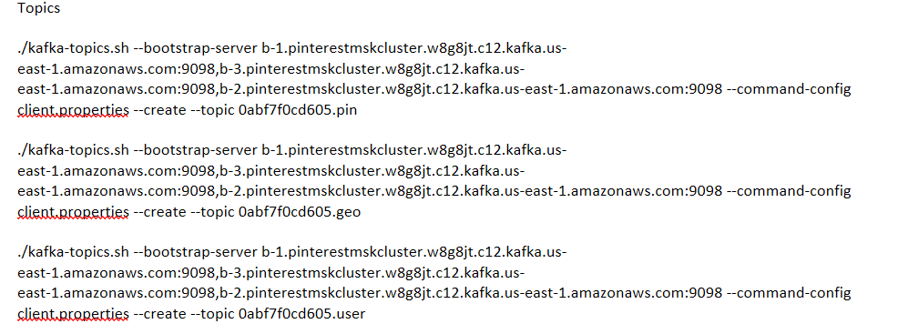
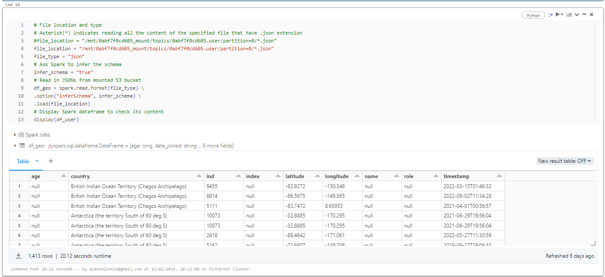

# Pinterest Data Pipelines
## Table of Contents
1. [Project description](#Project-description)
2. [Diagram of project architecture ](#Diagram-of-project-architecture)
3. [Installation instructions](#Installation-instructions)
4. [Project Code Breakdown](#Project-Code-Breakdown)
5. [File structure of the project](#File-structure-of-the-project)
6. [License](#license)

### Project code breakdown

##  Project description
The Pinterest Data Pipelines Project aims to create a data pipeline similar to Pinterest. The data pipeline enhances the efficiency, scalability, and reliability of data processing infrastructure. As data continues to grow and serve millions of users worldwide, it becomes increasingly crucial to streamline the collection, processing, and analysis of vast amounts of user-generated data to drive product improvements, personalized recommendations, and strategic decision-making.

## Diagram of project architecture

## Installation instructions
### Create.pem key
Create a file with a .pem extension 
Navigate to the Parameter store 

Find the specific key pair associated with your EC2 instance. 

Select this key pair and under the Value field select Show.

This will reveal the content of your key pair.

 Copy its entire value (including the BEGIN and END header) and paste it in the .pem file in VSCode.

 Navigate to the EC2 console and identify the instance with your unique UserId. Select this instance, and under the Details section find the Key pair name and make a note of this. Save the previously created file in the VSCode using the following format: Key pair name.pem

### Connect to E2C instance on SSH Client 
Navigate to EC2>Instances>your instance >Connect an instance.
 Follow the SHH Client instructions

Create the following commands for your vs code terminal 

chmod 400 "C:\Users\quann\OneDrive\Desktop\Data Engineering\Projects\Pinetrest_data_pipline\pyvenv\name.pem"

ssh -i "C:\Users\quann\OneDrive\Desktop\Data Engineering\Projects\Pinetrest_data_pipline\pyvenv\name.
pem" ec2-user@ec2-3-80-205-48.compute-1.amazonaws.com

Once run ... Your terminal should look like this

### Run Kafka on E2C instance 
Update Java using this command :

sudo yum install java-1.8.0

Install Kafka on your client EC2 machine using this command

wget https://archive.apache.org/dist/kafka/2.8.1/kafka_2.12-2.8.1.tgz
tar -xzf kafka_2.12-2.8.1.tgz

Install the IAM MSK authentication package on your client EC2 machine using this command

wget https://github.com/aws/aws-msk-iam-auth/releases/download/v1.1.5/aws-msk-iam-auth-1.1.5-all.jar

Navigate to Roles in IAM and change the Trust relationships Json to add the ARN in the summary box above

Configure your Kafka client to use AWS IAM authentication to the cluster by adding a configuration.properties file in your Kafka bin
Use this command to create the file
nano client.properties

The configuration file should look like this. Replace the awsRoleARN with your own ARN role

Find the Bootstrap servers string and the Plaintext Apache Zookeeper connection string. Make a note of these

Create a class path in the bin of your Kafka file:

export CLASSPATH=/home/ec2-user/kafka_2.12-2.8.1/libs/aws-msk-iam-auth-1.1.5-all.jar

Create these 3 topics using the Bootstrap Server and Arn role 

The ARN needed can be found in MSK > Clusters :
arn:aws:iam::584739742957:role/0abf7f0cd605-ec2-access-role

### Create a custom plugin with MSK
Go to the S3 console and find the bucket that contains your UserId and make a note of it 

On your EC2 client, download the Confluent.io Amazon S3 Connector and copy it to the S3 bucket you have identified in the previous step. Use the code below:

Wget https://client.hub.confluent.io/confluent-hub-client-latest.tar.gz
Create a class path for the above 
Export CLASSPATH=/home/ec2-user/kafka_2.12-2.8.1/bin/onfluent-hub-client-latest.tar.gz

Once done your vs code should look like this 

Create your custom plugin in the MSK Connect console

### Create a custom connector with MSK Connect

Now, open the MSK console and select Custom plugins under the MSK Connect section on the left side of the console. Choose Create custom plugin.

In the list of plugin, select the plugin you have just created, and then click Next

then choose your MSK cluster from the cluster list.

Change connector capacity to the following

Select IAM role previously created 

### Build a Kafka REST proxy integration method for the API

Create a resource that allows you to build a PROXY integration for your API.

Create a HTTP ANY method
To get started go to the API Gateway console and select one of your previously created APIs. Your API should have a {proxy+} resource. To set up an integration click on the ANY resource, then on the Edit integration button

For HTTP method select ANY.
For the Endpoint URL

Public IPv4 DNS copied : http://ec2-3-80-205-48.compute-1.amazonaws.com:8082/{proxy}

### Set up the Kafka REST proxy on the EC2 client 
First, install the Confluent package for the Kafka REST Proxy on your EC2 client machine.
To install the REST proxy package run the following commands on your EC2 instance:
sudo wget https://packages.confluent.io/archive/7.2/confluent-7.2.0.tar.gz
tar -xvzf confluent-7.2.0.tar.gz 
Your screen should look like this :

Once the file is downloaded and unzipped 

navigate to confluent-7.2.0/etc/Kafka-rest
nano kafka-rest.properties and add this code changing the arn as necessary and  bootstrap.servers and the zookeeper. Connect variables in this file, with the corresponding Bootstrap server string and Plaintext Apache Zookeeper connection string respectively

 Deploy the API and make a note of the Invoke URL

 
 
 https://kdnbpq3ufb.execute-api.us-east-1.amazonaws.com/Pinetrest

 Set up the Kafka REST proxy on the EC2 client 
 
 ./kafka-rest-start /home/ec2-user/confluent-7.2.0/etc/kafka-rest/kafka-rest.properties

 

 Modify the user_posting_emulation.py to send data to your Kafka topics using your API Invoke URL.
 
 
 You should have one invoke URL per a topic 
 
 invoke_url = "https://kdnbpq3ufb.execute-api.us-east-1.amazonaws.com/Pinetrest/topics/0abf7f0cd605.pin"
 
 invoke_url = "https://kdnbpq3ufb.execute-api.us-east-1.amazonaws.com/Pinetrest/topics/0abf7f0cd605.geo"
 
 invoke_url = "https://kdnbpq3ufb.execute-api.us-east-1.amazonaws.com/Pinetrest/topics/0abf7f0cd605.user"

 
 Check data is sent to the cluster by running a Kafka consumer (one per topic).
 Check if data is getting stored in the S3 bucket. Notice the folder organization
 
 

 ### Mount a S3 bucket to Databricks
 
 We will need to import the following libraries first
 
 

 Now let's read the table containing the AWS keys to Databricks using the code below:

 

 We can extract the access key and secret access key from the spark data frame created above. 

 

 We can now mount the S3 bucket by passing in the S3 URL and the desired mount name to dbutils.fs.mount(). 

 

 Read the JSON format dataset from S3 into Databricks using the code cells below:

 

 and now create 3 new Data frames
 

 

 

 ### Cleaning data

 I used the following codes to clean the databases:

 #### Clean pin data

 !

 ### Clean geo data

 

 ### Clean user data

 

 ### Querying data

 #### Find the most popular Pinterest category people post to based on their country?

 

 #### Find how many posts each category had between 2018 and 2022?

 

 #### Find the user with the most followers in each country?

 #### Find the most popular category for different age groups?

 #

 #### Find the median followers per age group?

 

 #### Find how many users have joined between 2015 and 2020?

 

 #### Find the median follower count of users have joined between 2015 and 2020?

 

 #### #Find the median follower count of users that have joined between 2015 and 2020, based on which age group they are part of?

 

 ### Create and upload a DAG to a MWAA environment

 

 Navigate to the MWAA console and select your Environment. Once you're on the environment page select Edit.

 

 

 unpause Dag
 

 ### Creating data streams using Kinesis Data Streams 
 Navigate to AWS Kinesis

 

 Navigate to the Kinesis console, and select the Data Streams section. Choose the Create stream button.
 Create these streams:
 - streaming-0abf7f0cd605-pin
 - streaming-0abf7f0cd605-geo
 - streaming-0abf7f0cd605-user
 The process should look like this:

In Kinesis > Data streams

Configure an API with Kinesis proxy integration

Under Resource Name, type streams. Leave the rest as default and then click the Create resource button.

In the Create method page you will need to define the following:

Select get method type

For Integration type select AWS Service
For AWS Region choose us-east-1
For AWS Service select Kinesis,
For HTTP method select POST (as we will have to invoke Kinesis's List Streams action)
For Action Type select User action name
For Action name type List Streams
For Execution role you should copy the ARN of your Kinesis Access Role (created in the previous section)

This will redirect you to the Method Execution page. From here select the Integration request panel, click on the Edit button at the bottom of the page

Find and expand URL request headers parameters and fill in the following

Expand Mapping Templates panel and fill in the following

Under the streams resource create a new child resource with the Resource name {stream-name}
Create GET, Post and Delete Methods under these
Under the {stream-name} resource create a two new child resources with the Resource Name, record and records. For both resources create a PUT method.

Deploy the API

### Send data to kinesis stream
Update the user_posting_emulation_streaming.py file 

invoke_url = 'https://kdnbpq3ufb.execute-api.us-east-1.amazonaws.com/Pinetrest/streams/stream-name/record'
restart the rest proxy 

Statues code 200 means everything is working fine

Check the Kinesis>Data Steams > Data viewer for data

It should look like this for each data stream

### Read data from Kinesis steams in Databricks

Initializing a Stream

Start by setting a Databricks notebook

Look for the data bricks datasets file paths 

### View each data stream by converting it into a table

### Write streaming data to delta tables.

Check tables have been created 

## Project code breakdown

### user_posting_emulation.py 
The code requires the Kafka REST proxy on the EC2 client to work. It has 3 different for loops for each topic and using the invoke URL from an API in AWS to load data into data bricks. The code will infinitely print a statues 200 response code if run correctly. It also includes a dictionary of each data structure of each topic.
### user_posting_emulation_streaming.py
The code requires the Kafka REST proxy on the EC2 client to work. It uses a for loop similar to the one in  user_posting_emulation.py however all the invoke URL are the same. The difference in these 3 loops is the different Stream names. This enables a constant stream of data to be created and this data is uploaded to data bricks using an API. A statues 200 code will be printed if the data is uploaded to AWS Kinesis correctly.
## File structure of the project
|
|-------Images 
|
|-------LICENSE 
|
|-------README.md
|
|-------LICENSE 
|
|-------user_posting_emulation_streaming.py
|
|-------user_posting_emulation.py 

## License 

Please see License file
